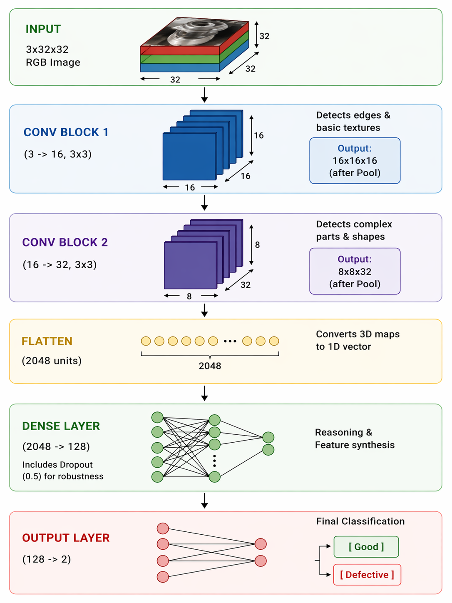
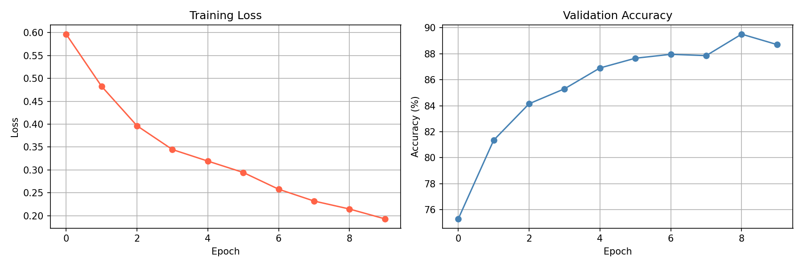

# Edge Defect Detector — CNN Binary Classifier

A lightweight CNN trained to classify defective vs non-defective parts,
simulating an Automated Optical Inspection (AOI) system used in industrial manufacturing.
Built from scratch with PyTorch, no pretrained models.

## Architecture


**Total parameters: 267,618 (~1MB)**

## Results

Trained for 10 epochs on 8,000 images, validated on 2,000.

| Epoch | Loss  | Val Accuracy |
|-------|-------|--------------|
| 1     | 0.597 | 75.3%        |
| 5     | 0.319 | 86.9%        |
| 10    | 0.193 | 88.7%        |
| best  | -     | **89.5%**    |



## How to Run

```bash
pip install -r requirements.txt
python train.py
```

## Future Improvements

- Replace CIFAR-10 with MVTec AD — a real industrial defect dataset used in research
- Quantise model to INT8 for deployment on Cortex-M MCU (TinyML) — reduces model size 4x
- Experiment with MobileNetV2 — state-of-the-art lightweight architecture for edge devices
- Add confusion matrix to better analyse false positives vs false negatives

Author: Pedro Trenado